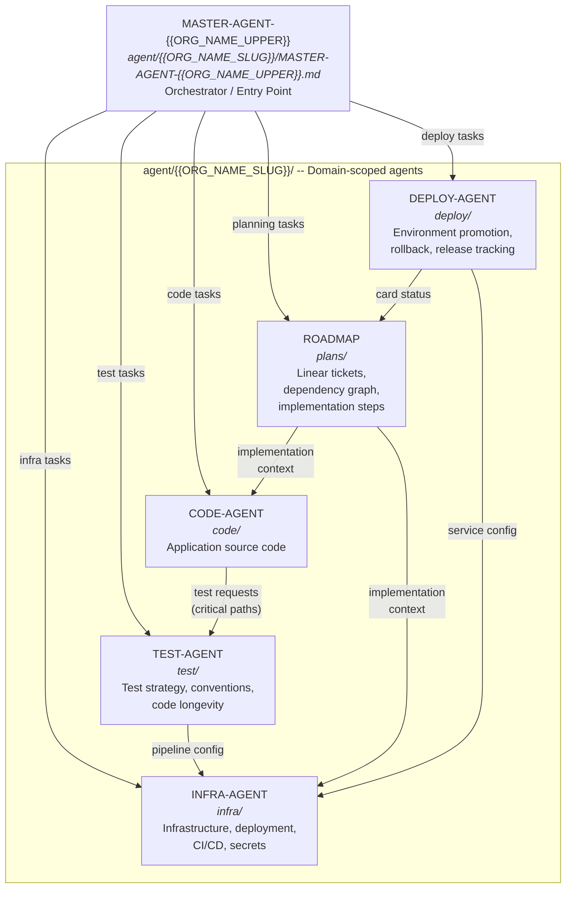

# MASTER-AGENT: {{ORG_NAME}}

```
CREATED: {{DATE}}
LAST_UPDATED: {{DATE}}
VERSION: 1.0.0
AGENT_INDUSTRY_VERSION: {{AGENT_INDUSTRY_VERSION}}
SCOPE: {{ORG_NAME}} domain -- orchestrates all agent knowledge
LINEAR_PROJECT: {{LINEAR_PROJECT}}
```

## Purpose

This is the single entry point for any agent working on the {{ORG_NAME}} project. It does NOT contain implementation details. Instead, it maps the domain into scoped agent files, describes their responsibilities, and tells you where to look and what to update for any given action.

Import this file when starting any task related to {{ORG_NAME}} (code, infra, deployment, planning).

## Domain Overview

{{DOMAIN_OVERVIEW}}

## Agent Architecture



## Folder Structure

```
agent/
  {{ORG_NAME_SLUG}}/
    MASTER-AGENT-{{ORG_NAME_UPPER}}.md           <-- you are here
    code/CODE-AGENT-{{ORG_NAME_UPPER}}.md        <-- application source code
    test/TEST-AGENT-{{ORG_NAME_UPPER}}.md        <-- test strategy & code longevity
    infra/INFRA-AGENT-{{ORG_NAME_UPPER}}.md      <-- infrastructure & deployment
    deploy/DEPLOY-AGENT-{{ORG_NAME_UPPER}}.md    <-- production deployment lifecycle
    plans/ROADMAP-{{ORG_NAME_UPPER}}.md          <-- implementation plan
templates/
  MASTER-AGENT-TEMPLATE.md
  CODE-AGENT-TEMPLATE.md
  TEST-AGENT-TEMPLATE.md
  INFRA-AGENT-TEMPLATE.md
  DEPLOY-AGENT-TEMPLATE.md
  ROADMAP-TEMPLATE.md
```

## Agent Registry

Each agent file owns a specific scope. When performing an action, consult the relevant agent(s) below. If your work touches multiple scopes, read all relevant agents.

### 1. Codebase -- CODE-AGENT-{{ORG_NAME_UPPER}}

```yaml
path: agent/{{ORG_NAME_SLUG}}/code/CODE-AGENT-{{ORG_NAME_UPPER}}.md
scope: Application source code, architecture, models, services, tests, Docker configuration
owns:
  - Application architecture and data flow
  - Data models, schemas, type system
  - External service integrations (from code perspective)
  - API layer and authentication
  - Design patterns and conventions
  - Dependency management
  - Docker images and build configuration
  - Testing patterns
  - Known gotchas and bugs

update_when:
  - Any code change to the application
  - New models, services, or API endpoints
  - New external service integrations
  - Schema or type system changes
  - Dependency version changes
  - Docker build changes
```

### 2. Testing -- TEST-AGENT-{{ORG_NAME_UPPER}}

```yaml
path: agent/{{ORG_NAME_SLUG}}/test/TEST-AGENT-{{ORG_NAME_UPPER}}.md
scope: Test strategy, test authoring conventions, critical path coverage, test lifecycle, and code longevity
owns:
  - Test framework configuration and tooling
  - Test structure and naming conventions (project-wide law)
  - Test categories and strategy (unit, integration, e2e)
  - Critical path coverage map and requirements
  - Mocking and test data patterns
  - Test modification policy (warns on test edits/deletes)
  - CI/CD test pipeline integration decisions
  - Code longevity monitoring (deprecation, dependency health, refactoring safety)

depends_on:
  - Code agent for architecture analysis and critical path identification
  - Infra agent for CI/CD pipeline stage configuration

update_when:
  - Test framework, runner, or assertion library changes
  - New test patterns or conventions adopted
  - Coverage thresholds change
  - CI/CD test pipeline stages change
  - New test categories introduced
  - Test data management strategy changes
  - Critical path coverage changes
  - Existing tests modified or deleted
```

### 3. Infrastructure -- INFRA-AGENT-{{ORG_NAME_UPPER}}

```yaml
path: agent/{{ORG_NAME_SLUG}}/infra/INFRA-AGENT-{{ORG_NAME_UPPER}}.md
scope: Deployment, Terraform/IaC, secrets architecture, CI/CD, and operational commands
owns:
  - Service definitions and deployment topology
  - Infrastructure as code (Terraform, CloudFormation, Pulumi, etc.)
  - Secret injection and management
  - Environment variables mapping
  - Database and broker configuration
  - Load balancer and DNS configuration
  - Container registry and image tagging
  - CI/CD pipeline
  - Health checks and monitoring
  - Operational commands (deploy, rollback, migrations)

update_when:
  - Infrastructure code changes
  - Deployment topology changes
  - Secret architecture changes
  - CI/CD pipeline changes
  - New environment provisioned
  - Health check or monitoring changes
  - Docker entrypoint or CMD changes
```

### 4. Roadmap -- ROADMAP-{{ORG_NAME_UPPER}}

```yaml
path: agent/{{ORG_NAME_SLUG}}/plans/ROADMAP-{{ORG_NAME_UPPER}}.md
scope: Implementation plan, Linear card rules, dependency graph, and step-by-step instructions
owns:
  - Phase definitions and dependency graph
  - Current state assessment
  - Step-by-step implementation instructions per phase
  - Design decisions log
  - Linear card creation and update rules (single source of truth)
  - Linear MCP tool usage patterns

linear_tickets:
{{LINEAR_TICKETS_LIST}}

update_when:
  - Phase completed or state changed
  - New Linear tickets created that affect this roadmap
  - Design decisions finalized
  - Implementation details changed during execution
  - Linear card rules or formatting standards change
```

### 5. Deploy -- DEPLOY-AGENT-{{ORG_NAME_UPPER}}

```yaml
path: agent/{{ORG_NAME_SLUG}}/deploy/DEPLOY-AGENT-{{ORG_NAME_UPPER}}.md
scope: Production deployment lifecycle, environment promotion, rollback, and release tracking
owns:
  - Environment topology (accounts, clusters, domains per environment)
  - Promotion pipeline and gate requirements
  - Pre-deploy checklists per environment
  - Deploy procedures (image promotion, Terraform apply, service deploy)
  - Rollback procedures (circuit breaker, manual rollback, Terraform revert)
  - Release tracking (Linear card lifecycle, changelog, post-deploy updates)

depends_on:
  - Per-service INFRA-AGENTs for service configuration
  - Roadmap agents for Linear card state

update_when:
  - New environment added or removed
  - Promotion pipeline gates change
  - Rollback procedures change
  - New service added to the deployment pipeline
  - Image promotion strategy changes
  - Release tracking process changes
```

## Linear Card Policy

Before creating or updating any Linear card, you MUST read the roadmap agent first:

```
agent/{{ORG_NAME_SLUG}}/plans/ROADMAP-{{ORG_NAME_UPPER}}.md
```

The roadmap owns all Linear card rules: structure, formatting, tone, defaults, MCP tool usage, and confidentiality constraints. No other agent file duplicates these rules. Always defer to the roadmap's "Linear Card Rules" section.

## Action Routing

Use this table to determine which agent(s) to read for common tasks:

| Action | Read |
|--------|------|
| Add a new feature or module | Code + Test (if critical path) |
| Add a new API endpoint | Code + Test |
| Fix a bug in application logic | Code + Test (regression test) |
| Write or update tests | Test |
| Modify or delete existing tests | Test (modification policy applies) |
| Check test coverage for critical paths | Test |
| Change infrastructure code (Terraform, etc.) | Infra |
| Deploy to development | Infra |
| Run database migrations | Infra |
| Change CI/CD pipeline | Infra + Test (pipeline integration) |
| Add monitoring or alerting | Infra |
| Promote to staging or production | Deploy |
| Roll back a deployment | Deploy |
| Check production readiness | Deploy + Roadmap + Test |
| Track a release (changelog, Linear cards) | Deploy + Roadmap |
| Implement a roadmap phase | Roadmap + relevant scope (Code, Test, and/or Infra) |
| Create or update a Linear card | Roadmap first, then the relevant scope |

## Update Protocol

After completing any task:

1. Identify which agent file(s) your changes affect using the `update_when` triggers above
2. Update those files with the new state
3. If a roadmap phase was completed, update the roadmap status and dependency graph

## Document Maintenance

```
CREATED: {{DATE}}
LAST_UPDATED: {{DATE}}
DOCUMENT_OWNER: {{ORG_NAME}} Team
AUTHORS: [TO BE FILLED]

UPDATE_TRIGGERS:
- New agent files created for this domain
- Agent file scope changes
- New Linear tickets added to the roadmap
- Action routing table needs new entries
- Folder structure changes
```

END_OF_DOCUMENT
